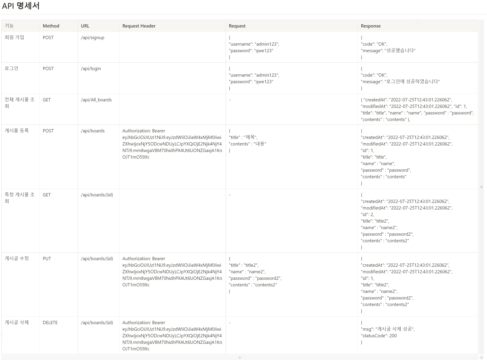

# Spring_Homework_2(JWT)

Spring 2주차 개인 과제
=====================

## 서비스 완성 요구 사항

1. JWT를 활용하여 요구 사항 완성
2. 회원가입 API 
3. 로그인 API
4. 전체 게시글 목록 조회 API
5. 게시글 작성 API
6. 선택한 게시글 조회 API
7. 선택한 게시글 정정 API
8. 선택한 게시글 삭제 API

## UseCase

---

## API 명세서

---

## ERD 

---

---

## 질문

---

1. 처음 설계한 API 명세서에 변경사항이 있었나요? 
변경 되었다면 어떤 점 때문 일까요? 첫 설계의 중요성에 대해 작성해 주세요!
- 로그인과 회원가입 부분에 대한 API 구성이 변경됨.
2. ERD를 먼저 설계한 후 Entity를 개발했을 때 어떤 점이 도움이 되셨나요?
- 연관관계를 미리 확인할 수 있어 논리적 구성이 신속하다.
3. JWT를 사용하여 인증/인가를 구현 했을 때의 장점은 무엇일까요?
- 서버와의 세션을 유지하지 않아도 되며, 인증된 토큰으로 리소스를 많이 잡지 않아도 되는 장점이 있다.
4. 반대로 JWT를 사용한 인증/인가의 한계점은 무엇일까요?
- 단일키로 인해 유출되면 치명적이다. 구현의 복잡성이 높고, 내용이 많아지면 리소스 비용도 증가한다.
5. 만약 댓글 기능이 있는 블로그에서 댓글이 달려있는 게시글을 삭제하려고 한다면 무슨 문제가 발생할까요? Database 테이블 관점에서 해결방법이 무엇일까요?
- 댓글에 관련된 게시글은 없어졌지만 댓글에 대한 내용은 없어지지 않기에 DB 리소스를 차지한 상태로 남습니다.
- 게시글과 연관된 댓글들에 대해 외부키를 부여하여 삭제할 시에 일치하는 댓글을 삭제하는 방향으로 잡습니다.
6. IoC / DI 에 대해 간략하게 설명해 주세요!
IoC = 메소드나 객체의 호출 작업을 개발자가 결정하는 것이 아니라, 외부에서 결정되는 것. 객체의 의존성을 역전시켜 객체 간의 결합도를 줄이고 유연한 코드를 작성할 수 있게 하여 가독성 및 코드 중복, 유지 보수를 편하게 할 수 있게 한다.
DI = 객체를 직접 생성하는 게 아니라 외부에서 생성한 후 주입 시켜주는 방식. DI ( 의존성 주입 )를 통해서 모듈 간의 결합도가 낮아지고 유연성이 높아진다.